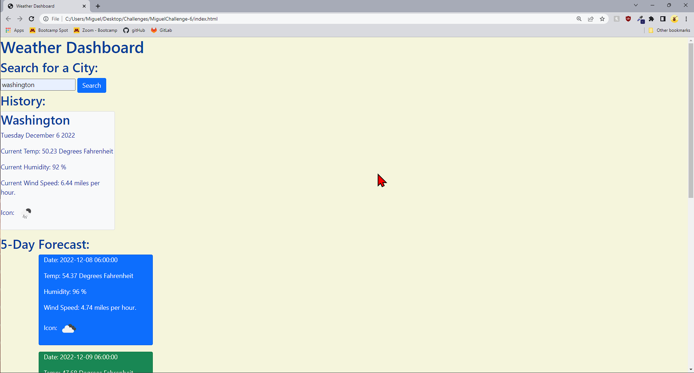
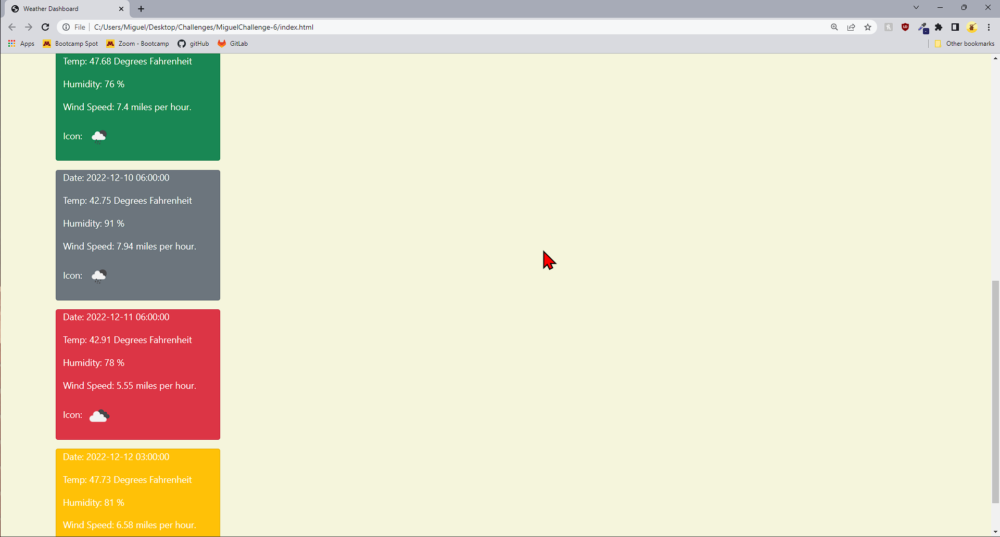

# My Weather Dashboard

## Description 
- Website created to inform users about the weather in the next 5 days for their city of choosing.

## Table of contents
- [Description](#description)
- [Usage](#usage)
- [Credits](#credits)
- [License](#license)
- [Badges](#badges)

## Usage
- 
 Javascript Weather Dashboard allows users to see prepare for the next five days by giving the user weather information for their city. 

- <a href="https://darkunitx.github.io/Miguel-Weather-Dashboard/">Weather Dashboard Live Website</a>
- <a href="https://github.com/Darkunitx/Miguel-Weather-Dashboard">Weather Dashboard Github Repo</a>

## Credits 
- in collaboration with :
- Nicholas Mamberger https://github.com/NickHM05
- Tutor Scott Everett

- Websites utilized : 
- https://developer.mozilla.org/en-US/docs/Web/API/HTMLFormElement/submit_event
- file:///C:/Users/Miguel/Desktop/BootCamp/UofM-VIRT-FSF-PT-10-2022-U-LOLC/06-Server-Side-APIs/01-Activities/27-Stu_Mini-Project/Main/index.html
- https://stackoverflow.com/questions/47587849/get-request-for-openweather-api-not-working
- https://zoom.us/rec/play/jbhBy0TzP_ZbGVgfCUJlPDpFsAwQFTelyNuA8_OvG9E1Sdbcy4natXENuZd1BBKb-PiBUKwRpHQB1nQw.UFFy_GqQVAC3xlJy
- https://openweathermap.org/api/geocoding-api
- https://openweathermap.org/forecast5
- https://home.openweathermap.org/api_keys
- https://getbootstrap.com/docs/4.0/components/card/

## License

- MIT License

- Copyright (c) [2022] [Miguel Montenegro Weather Dashboard]

- Permission is hereby granted, free of charge, to any person obtaining a copy of this software and associated documentation files (the "Software"), to deal in the Software without restriction, including without limitation the rights to use, copy, modify, merge, publish, distribute, sublicense, and/or sell copies of the Software, and to permit persons to whom the Software is furnished to do so, subject to the following conditions:

- The above copyright notice and this permission notice shall be included in all copies or substantial portions of the Software.

- THE SOFTWARE IS PROVIDED "AS IS", WITHOUT WARRANTY OF ANY KIND, EXPRESS OR IMPLIED, INCLUDING BUT NOT LIMITED TO THE WARRANTIES OF MERCHANTABILITY, FITNESS FOR A PARTICULAR PURPOSE AND NONINFRINGEMENT. IN NO EVENT SHALL THE AUTHORS OR COPYRIGHT HOLDERS BE LIABLE FOR ANY CLAIM, DAMAGES OR OTHER LIABILITY, WHETHER IN AN ACTION OF CONTRACT, TORT OR OTHERWISE, ARISING FROM, OUT OF OR IN CONNECTION WITH THE SOFTWARE OR THE USE OR OTHER DEALINGS IN THE SOFTWARE.

## Badges

